# Architekturdokumentation (arc42 v8) – HSLU_WEBLAB

> **Webapplikation für Tourenverwaltung & 3x3 Sicherheitsmatrix**  
> Modul **WebLab** | Hochschule Luzern (Departement Informatik)  
> Student: **Colin Felber** | Dozent: **Dominik Witschard**

Kompilierung der Dokumentation:
```bash
make architektur
# oder zusammen mit allen Dokumenten:
make all
```
Das fertige PDF liegt unter: [`Doc/architektur.pdf`](../architektur.pdf).

---

## Einführung & Ziele

Wer eine Skitour für eine Gruppe leitet, trägt viel Verantwortung. Kommt es zu einem Notfall am Berg, muss die Tourenleitung sofort die Notfallkontakte der Teilnehmenden griffbereit haben. Zudem fordert die Rechtsprechung im Ernstfall den Nachweis einer sorgfältigen Tourenplanung nach anerkannten Standards – insbesondere der **3x3-Sicherheitsmatrix** nach Werner Munter (Verhältnisse, Gelände, Mensch).

Normale Chat-Apps oder Vereins-Tools reichen dafür nicht aus: Notfallkontakte fehlen oder sind unauffindbar, und die 3x3-Planung kann nirgends strukturiert festgehalten werden. Die vorliegende Webapplikation schliesst diese Lücke.

### Qualitätsziele
| Prio | Qualitätsziel | Bedeutung für die Applikation |
|---|---|---|
| **1** | Datenschutz & Vertraulichkeit | Notfallkontakte sind hochsensibel. Ausschliesslich autorisierte Tourenleiter der jeweiligen Tour dürfen sie einsehen (*Principle of Least Privilege*). |
| **2** | Schnelligkeit & Usability | Schnelle Bedienung am Handy und Desktop. Die 3x3-Matrix ist in wenigen Minuten ausgefüllt, Notfallkontakte sind mit einem Klick sichtbar. |
| **3** | Wartbarkeit & Testbarkeit | Klare Entkopplung: Smart/Dumb-Muster im Frontend, modularer Monolith mit NestJS im Backend, abgesichert durch Unit- und Cypress-E2E-Tests. |
| **4** | Ein-Befehl-Start | Vollständiger Start des Stacks via `docker compose up --build` ohne manuelle Vorabinstallation von Node oder Datenbanken. |

### Stakeholder
| Rolle | Wer ist das? | Erwartungshaltung |
|---|---|---|
| **Tourenleiter/in** | Leiter/in von SAC- oder privaten Touren | Strukturierte 3x3-Dokumentation zur rechtlichen Absicherung, Teilnehmerübersicht und Notfallkontakte im Ernstfall. |
| **Teilnehmende** | Mitglieder der Tourengruppe | Einfacher Beitritt per Link, Übersicht zu Treffpunkt, Route und Ausrüstung, garantierter Schutz der Notfalldaten. |
| **Dozent / Experte** | Dominik Witschard (HSLU) | Klare Softwarearchitektur, nachvollziehbar begründete Technologiewahl, Testabdeckung und verständlicher Code. |

---

## Kontext & Abgrenzung

### Fachlicher & Technischer Kontext
- Der Browser kommuniziert über HTTP (Port 80) mit Nginx.
- Nginx leitet API-Aufrufe (`/api/*`) intern an das NestJS-Backend (Port 4566) weiter.
- Das Backend greift über das MongoDB-Wire-Protokoll (Port 27017) auf die Datenbank zu.

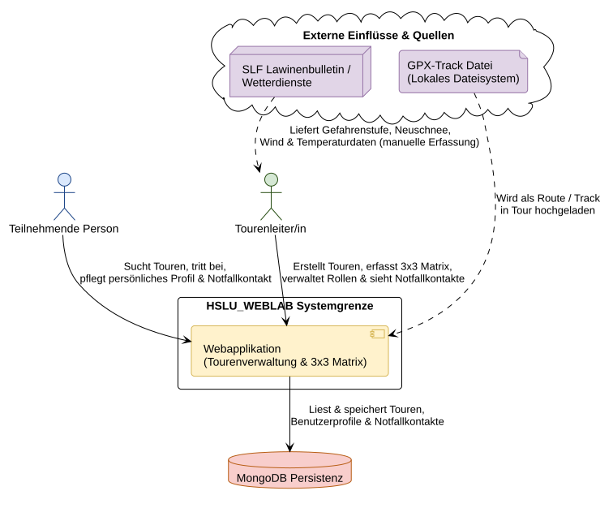
*PlantUML-Quelle: [`diagrams/01_kontext_abgrenzung.puml`](diagrams/01_kontext_abgrenzung.puml)*

### In Scope (+)
- **+** Touren-CRUD: Vollständiges Erstellen, Anzeigen, Bearbeiten und Löschen von Touren (Mindestanforderung).
- **+** Unterschiedliche Darstellungsformen: Präsentation der Tourendaten in drei inhaltlich eigenständigen Darstellungsformen (Mindestanforderung): Kachel-/Katalogansicht (`TourPreview`), interaktive geografische Karte (`Map` mit Leaflet & GPX-Visualisierung) und strukturierte 3x3-Risikomatrix (`SecurityMatrixDisplay`).
- **+** Digitale 3x3-Sicherheitsmatrix: Strukturierte Risikobeurteilung nach Werner Munter (Verhältnisse, Gelände, Mensch).
- **+** Notfallkontakt-Erfassung: Hinterlegung bei der Registrierung und Bearbeitung im Profil.
- **+** Geschützter Notfallkontakt-Zugriff: Zugriff auf Notfalldaten ausschliesslich für autorisierte Tourenleiter der jeweiligen Tour (Principle of Least Privilege).
- **+** Teilnehmer- und Rollenverwaltung: Beitritt per Link und Verwaltung von Leiter- und Teilnehmerrollen.
- **+** GPX-Routenupload: Hochladen und Anzeigen von GPX-Tracks direkt in der Tour.

### Out of Scope (-)
- **-** Native Mobile Apps: Keine eigenständigen Apps für iOS oder Android (reine responsive Web-App).
- **-** Automatisches Lawinenbulletin: Kein API-Scraping von SLF- oder Wetterdiensten (manuelle Erfassung).
- **-** E-Mail-Dienste: Keine E-Mail-Verifikation und kein Passwort-Reset per Mail.
- **-** Zahlungsabwicklung: Keine Online-Abrechnung von Tourenkosten.
- **-** Live-GPS-Tracking: Keine Turn-by-Turn-Navigation oder Live-Ortung während der Tour.
- **-** Offline-Synchronisation: Keine vollumfängliche PWA mit lokaler IndexedDB-Synchronisation.

---

## Lösungsstrategie

Die Lösungsstrategie beschreibt die grundlegenden architektonischen Leitlinien und Ansätze, mit denen die in Kapitel 1 definierten Qualitätsziele (Datenschutz, Schnelligkeit/Usability, Wartbarkeit/Testbarkeit, 1-Befehl-Start) realisiert werden:

1. **Entkoppelter Fullstack-Webstack (Modularer Monolith REST API + Standalone SPA)**:
   Das Gesamtsystem wird in ein typisiertes TypeScript-Frontend (Angular 19) und ein strukturiertes TypeScript-Backend (NestJS 11) getrennt, die über eine RESTful JSON-Schnittstelle kommunizieren. Im Backend sichert der Aufbau als Modularer Monolith (`auth`, `tours`, `users`) eine saubere Domänentrennung und hohe Testbarkeit ohne die Netzwerk- und Betriebs-Komplexität von Microservices (-> ADR-01).

2. **Datenschutz & Least Privilege an der Servergrenze**:
   Hochsensible Notfallkontakte werden serverseitig in allen Standard-DB-Abfragen per Mongoose-Projektion maskiert (`.select('-emergencyContact')`). Eine Einsicht erfolgt ausschliesslich über einen gesonderten Endpunkt, der die Tourenleiter-Rolle des anfragenden JWT-Nutzers zwingend prüft. Sensible Daten werden niemals unbefugt an den Browser ausgeliefert (-> ADR-04, ADR-06).

3. **Dokumentenorientiertes Aggregat-Muster (MongoDB)**:
   Die 3x3-Sicherheitsmatrix und Notfallkontakte bilden fachlich feste Aggregate mit ihrer jeweiligen Entität (Tour bzw. Person). Sie werden direkt als BSON-Subdokumente eingebettet. Dies verhindert teure Joins, sichert atomare Updates (`$addToSet`) und ermöglicht schemalose Felderweiterungen ohne SQL-Migrationen (-> ADR-03).

4. **Framework-native Reaktivität (Signals & Smart/Dumb)**:
   Im Frontend wird auf schwere externe State-Libraries (wie NgRx/Redux) verzichtet. Stattdessen etablieren Angular Signals (`signal`, `computed`, `httpResource`) und das Smart/Dumb-Komponentenmuster eine feingranulare, transparente Reaktivität mit minimalem Boilerplate und automatischer Change Detection (`OnPush`) (-> ADR-02).

5. **Zero-CORS Reverse-Proxy & Container-Deployment**:
   Ein schlanker Nginx-Container fungiert als einziger öffentlicher Einstiegspunkt (Port 80). Er liefert das statische Angular-Produktionsbundle aus und leitet API-Aufrufe (`/api/*`) intern an das NestJS-Backend weiter. Dies eliminiert CORS-Probleme vollständig und ermöglicht den reproduzierbaren 1-Befehl-Start via Docker Compose (-> ADR-05).

---

## Bausteinsicht

### Level 1: System-Whitebox
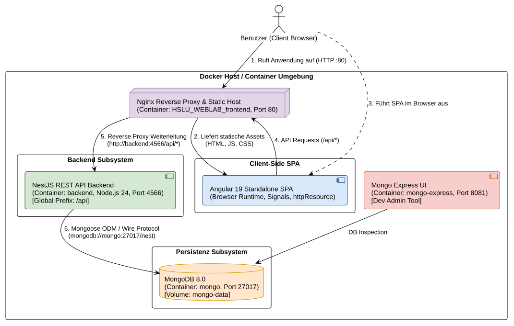
*PlantUML-Quelle: [`diagrams/02_bausteinsicht_level1.puml`](diagrams/02_bausteinsicht_level1.puml)*

| Container | Technologie | Verantwortung & Schnittstellen |
|---|---|---|
| `HSLU_WEBLAB_frontend` | nginx:alpine | Haupteinstiegspunkt (Port 80). Liefert das Angular-Bundle aus und proxied `/api/*` an das Backend weiter. |
| `backend` | NestJS 11, Node.js 24 | REST-API auf internem Port 4566. Verarbeitet Business-Logik, Validierung und Berechtigungsprüfungen. |
| `hslu_weblab_mongo` | mongo:8 | MongoDB-Server auf Port 27017. Speichert Daten dauerhaft im Volume `mongo-data`. |
| `hslu_weblab_mongo_express` | mongo-express:1 | Web-Admin-Tool auf Port 8081 zur Datenbank-Inspektion während der Entwicklung. |

### Level 2: Backend-Architektur (NestJS Modular Monolith)
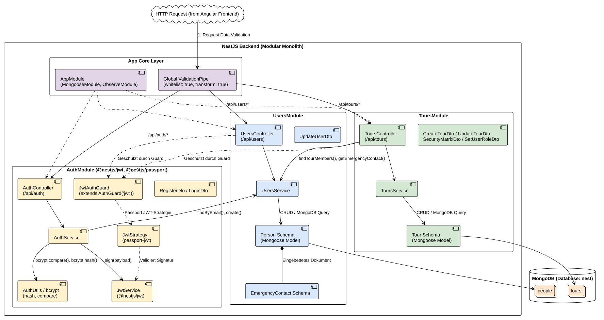
*PlantUML-Quelle: [`diagrams/04_backend_architektur.puml`](diagrams/04_backend_architektur.puml)*

### Level 2: Frontend-Architektur (Smart Container / Dumb Components)
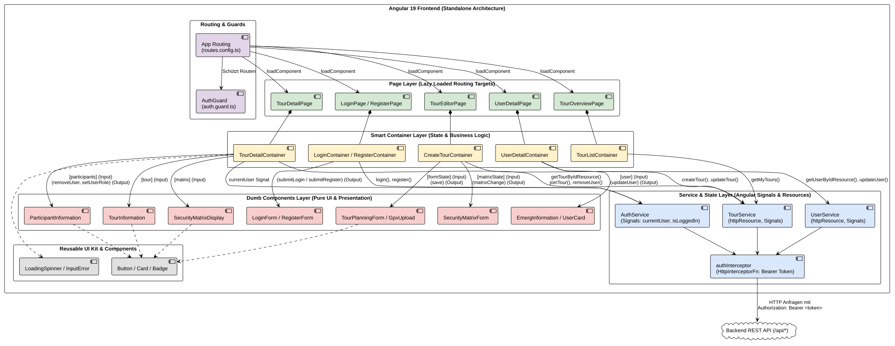
*PlantUML-Quelle: [`diagrams/03_frontend_architektur.puml`](diagrams/03_frontend_architektur.puml)*

| Ordner / Bereich | Inhalt & Verantwortung |
|---|---|
| `src/app/features/tour-management/` | Tourenverwaltung in verschiedenen Darstellungsformen: Katalogübersicht (`TourPreview`), interaktive Karte (`Map` mit Leaflet/GPX), Detailansicht (`TourInformation`), Teilnehmerliste und 3x3-Matrix (`SecurityMatrixDisplay`). |
| `src/app/features/tour-editor/` | Formulare zur Tourenerstellung und Bearbeitung der 3x3-Matrix, GPX-Upload. |
| `src/app/features/user/` | Benutzerprofil, Bearbeitung der Notfallkontakte, geschützte Notfallansicht. |
| `src/app/features/auth/` | Login- und Registrierungsformulare, `AuthService`, `authInterceptor`, `authGuard`. |
| `src/app/components/` | Wiederverwendbares UI-Kit (Button, Card, Badge, LoadingSpinner, InputFieldError). |
| `src/app/pipes/` | Wiederverwendbare Hilfs-Pipes (`ShortenerPipe`). |

---

## Laufzeitsicht

### Szenario 1: Registrierung & Token-Generierung
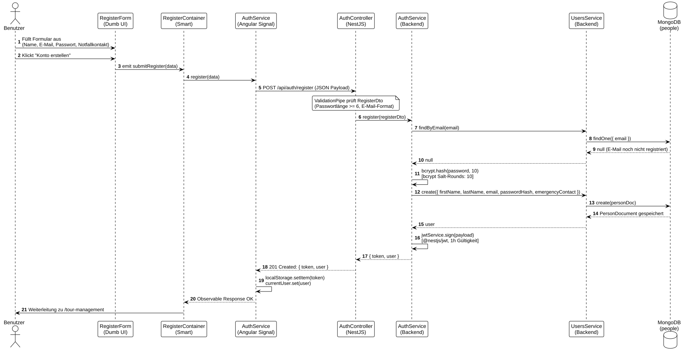
*PlantUML-Quelle: [`diagrams/05_laufzeitsicht_auth.puml`](diagrams/05_laufzeitsicht_auth.puml)*

### Szenario 2: Tour erstellen mit 3x3 Sicherheitsmatrix
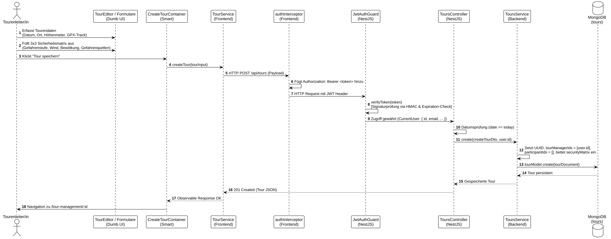
*PlantUML-Quelle: [`diagrams/06_laufzeitsicht_tour_erstellung.puml`](diagrams/06_laufzeitsicht_tour_erstellung.puml)*

### Szenario 3: Tour-Beitritt & Notfallkontakt-Abfrage
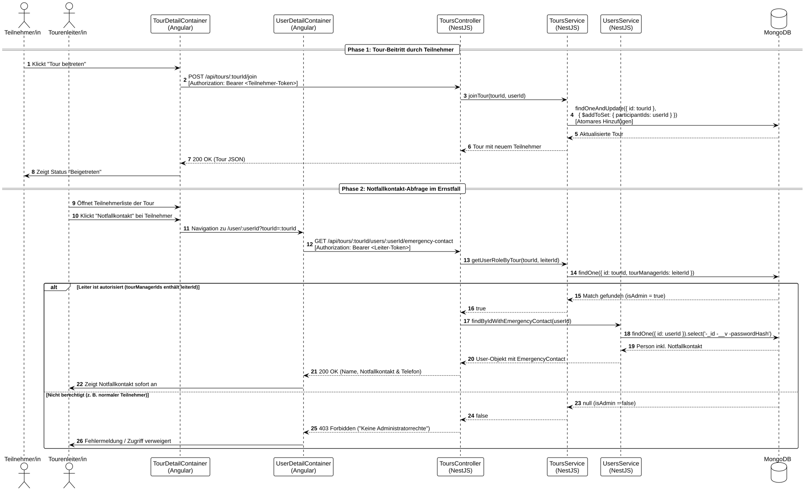
*PlantUML-Quelle: [`diagrams/07_laufzeitsicht_notfallkontakt.puml`](diagrams/07_laufzeitsicht_notfallkontakt.puml)*

---

## Verteilungssicht & Deployment

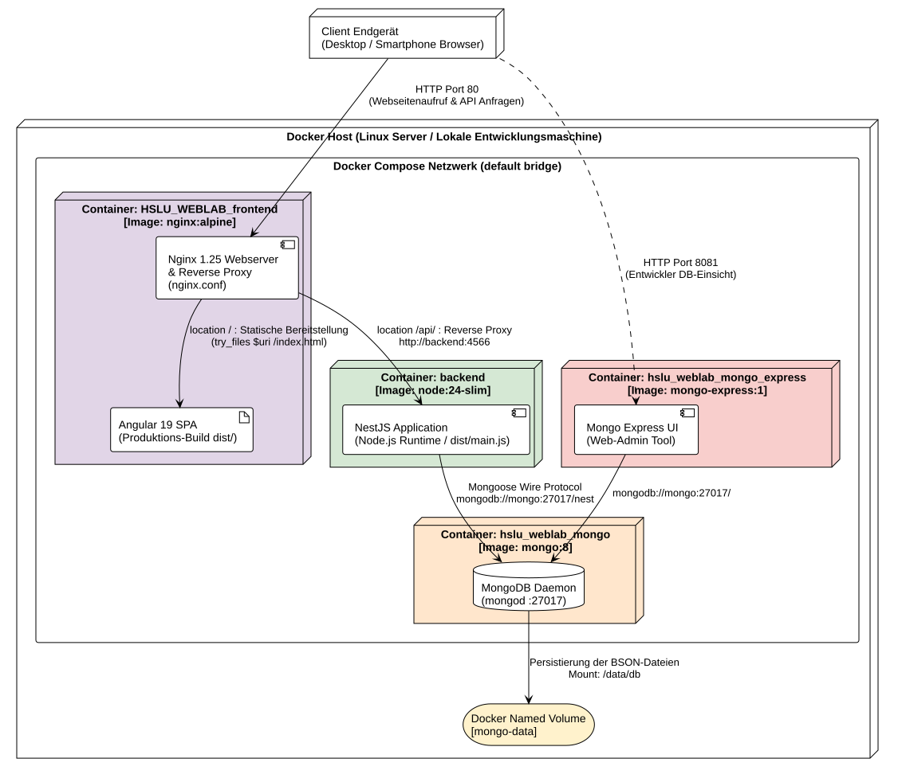
*PlantUML-Quelle: [`diagrams/08_verteilungssicht_deployment.puml`](diagrams/08_verteilungssicht_deployment.puml)*

- **Frontend**: Stage 1 (`node:24-slim`) baut Angular (`npm run build`). Stage 2 (`nginx:alpine`) übernimmt nur den fertigen `dist/`-Ordner.
- **Backend**: Stage 1 kompiliert TypeScript. Stage 2 führt nur `dist/` mit Produktions-Dependencies aus.
- **Nginx-Routing**: Serviert Angular per HTML5-Fallback (`try_files $uri /index.html`) und leitet `/api/` an das Backend weiter (`proxy_pass http://backend:4566`).

### Automatisierte CI/CD Pipeline (GitHub Actions)
Neben dem reproduzierbaren 1-Befehl-Start via `docker compose up --build` wird die Codebasis bei jedem Push und Pull Request auf `main` über eine dreistufige GitHub Actions Pipeline (`.github/workflows/ci.yml`) automatisiert geprüft:
- **Backend-Job**: Linter (`oxlint`/ESLint), TypeScript-Build, 51 Unit-Tests und 20 API-Integrationstests gegen `MongoMemoryServer`.
- **Frontend-Job**: Dependency-Installation (`npm ci`), Multi-Stage Build und 121 Frontend-Unit-Tests via Vitest.
- **E2E-Job**: Cypress-Integrationstests zur Validierung der Gesamtabläufe (Authentifizierung, Tourenverwaltung, Navigation).

---

## Querschnittskonzepte

### Ownership, Datenschutz & Sicherheit
- **Datenschutz**: Standardabfragen filtern Notfallkontakte immer serverseitig aus (`.select('-emergencyContact')`).
- **Authentifizierung**: Zustandsloses JWT, signiert via `@nestjs/jwt` (1h Lebensdauer) und validiert über eine Passport-JWT-Strategie (`JwtStrategy`). Passwörter werden sicher mit `bcrypt` gehasht (10 Salt-Rounds) und verifiziert.
- **Validierung & NoSQL-Schutz**: NestJS `ValidationPipe` (`whitelist: true, transform: true`) verwirft unbekannte Payload-Felder. Falsche Datumsformate oder NoSQL-Injection-Versuche (`$gt`, `$where`) werden sofort mit HTTP 400 geblockt.
- **Fehlerformat (Error Handling)**: NestJS liefert Fehler standardisiert als JSON: `{"statusCode": 400, "message": ["..."], "error": "Bad Request"}`. Frontend wertet `error.message` aus und zeigt sie im UI an.

### Datenmodell & Konsistenz
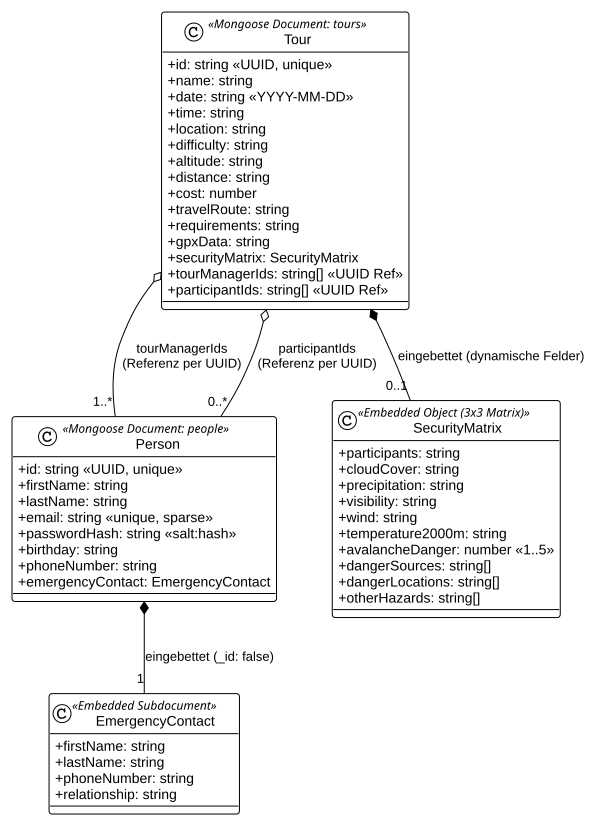
*PlantUML-Quelle: [`diagrams/09_datenmodell_persistenz.puml`](diagrams/09_datenmodell_persistenz.puml)*

- **Eingebettet**: `EmergencyContact` in `Person` (`_id: false`) und `SecurityMatrix` in `Tour`.
- **UUIDs statt MongoDB ObjectIds**: Anwendungsgenerierte UUIDs (`crypto.randomUUID()`) als primäre `id: string`. Referenzen (`tourManagerIds`, `participantIds`) werden im Service-Layer per `findByIds({ id: { $in: ids } })` aufgelöst statt über Mongoose-`populate()`.

### Frontend-Konzepte & Reaktivität
| Thema | Umsetzung & Ansatz |
|---|---|
| **Reaktivität** | Angular Signals (`signal`, `computed`) für lokalen State; `httpResource` für deklaratives Laden. |
| **Komponenten-Kommunikation** | Smart Container verwalten State; Dumb Components nutzen ausschliesslich `@Input` und `@Output`. |
| **Change Detection** | `ChangeDetectionStrategy.OnPush` auf allen Komponenten für maximale Performance. |
| **Styling & Feedback** | CSS Design-System mit Farbcodes für Lawinenwarnstufen; Validierungsfeedback via `InputFieldError`. |
| **Responsive Design** | Mobile-First via CSS Flexbox & Grid; grossflächige Touch-Bedienung für den Bergsport; dynamisches Leaflet-Resize. Nachgewiesen durch Lighthouse Mobile Score > 90. |
| **Offline-Strategie** | Tokens/User im `localStorage`. Für Notfallkontakte ohne Netz ist der Ausbau zur PWA konzipiert. |

### Bewusste Architektur-Abweichungen & Trade-offs
Zur Erfüllung der Qualitätsziele und Vermeidung unnötiger Komplexität wurden bewusste architektonische Abweichungen von gängigen Standardmustern gewählt:
- **Signals statt externem State-Management (NgRx/Redux)**: Für den Scope der Applikation bieten Angular Signals (`signal`, `computed`, `httpResource`) eine leichtgewichtige, performante Reaktivität ohne komplexen Action/Reducer-Boilerplate.
- **Reine Client-SPA statt SSR (Server-Side Rendering)**: Da sensible Notfalldaten geschützt hinter dem Login liegen, bietet SSR für SEO keinen Mehrwert. Eine reine SPA maximiert Client-Performance und vereinfacht zukünftiges PWA-Caching im Funkloch.
- **UUIDs statt MongoDB ObjectIds & Service-Layer Resolving**: Domänen-IDs werden als UUIDs generiert. Referenzen (`tourManagerIds`, `participantIds`) werden im Service über `$in`-Queries aufgelöst statt über Mongoose-`populate()`, was die Domäne sauber von Datenbank-Interna entkoppelt.
- **Eingebettete BSON-Dokumente statt Tabellen-Normalisierung**: Die 3x3-Sicherheitsmatrix und Notfallkontakte sind als Subdokumente direkt eingebettet. Dies verhindert teure Joins und garantiert atomare Konsistenz beim Speichern.

### Dependency Supply Chain
Abhängigkeiten werden über `npm ci` auf Basis einer versionierten `package-lock.json` festgeschrieben. In den Docker-Builds kommen schlanke, offizielle Node.js 24- und Nginx-Alpine-Images zum Einsatz.

### Testing
| Test-Typ | Werkzeug | Anzahl | Was wird abgedeckt? |
|---|---|---|---|
| **Backend Unit** | Vitest | 9 Files | Services (`users`, `tours`, `auth`), JwtStrategy, JwtAuthGuard, DTO-Validierung, Hash-Utils. |
| **Backend Integration** | Vitest / Supertest | 1 File | REST-Endpunkte gegen die Test-Datenbank (`api.integration.spec.ts`). |
| **Frontend Unit** | Vitest | 23 Files | Smart Container, Dumb Components (`security-matrix`), Services, Pipes, UI-Kit. |
| **Frontend E2E** | Cypress | 5 Files | Auth-Flow, Tourenverwaltung, Toureneditor, Tourdetails, Navigation. |

Befehle: `npm test` im Frontend/Backend, `npm run test:e2e` im Backend, `npm run cypress:run` im Frontend.

---

## Architekturentscheidungen (ADRs)

Architekturentscheidungen dokumentieren wesentliche Technologie- und Strukturwahlen inklusive des Entscheidungskontexts, der verworfenen Alternativen und der resultierenden Trade-offs:

### ADR-01: Backend mit NestJS (Modularer Monolith)
- **Kontext & Problem**: Gesucht war ein robustes Backend-Framework mit klarer Schichtenarchitektur, Dependency Injection und automatischer Request-Validierung.
- **Entscheidung**: NestJS 11 auf Node.js 24 mit TypeScript. Modularer Monolith unterteilt in fachliche Domänen (`auth`, `tours`, `users`). Validierung über DTOs mit `class-validator`.
- **Verworfene Alternativen**: *Express.js (barebone)*: Bietet keine strukturierte Schichtenarchitektur und keinen DI-Container, was bei wachsender Domänenlogik rasch zu unübersichtlichem Code führt. *Microservices*: Zu hoher Deployment-, Netzwerk- und Monitoring-Overhead für ein Semesterprojekt.
- **Konsequenzen & Trade-offs**: (+) Hohe Typsicherheit, klare Schichtentrennung (Controller, Service, Modul), identische Denkweise wie in Angular. (-) Einarbeitungsaufwand in TypeScript-Decorators und NestJS-Modul-Wiring.

### ADR-02: Frontend mit Angular 19 Standalone & Signals
- **Kontext & Problem**: Aufbau einer reaktiven Single Page Application mit schnellen Ladezeiten, klarer Trennung von UI und State sowie minimalem Boilerplate.
- **Entscheidung**: Angular 19 mit Standalone Components, Angular Signals (`signal`, `computed`, `httpResource`) und Smart/Dumb-Muster.
- **Verworfene Alternativen**: *React*: Kein integriertes Routing- oder Forms-System; erfordert viele heterogene Dritt-Bibliotheken. *Angular mit NgRx*: Hohe Boilerplate-Menge (Actions, Reducers, Effects, Selectors), die für die Projektgrösse unverhältnismässig gewesen wäre.
- **Konsequenzen & Trade-offs**: (+) Keine veralteten `NgModule`s, feingranulare Reaktivität ohne RxJS-Subscription-Leaks, optimale Performance durch `OnPush`. (-) Sehr neue APIs (`httpResource`), wenig historische Dokumentation.

### ADR-03: Persistenz mit MongoDB & Mongoose (Embedded Aggregates)
- **Kontext & Problem**: Speicherung von Touren mit hierarchischen, dynamischen 3x3-Matrixfeldern und Notfallkontakten.
- **Entscheidung**: MongoDB 8.0 mit Mongoose ODM. Die 3x3-Sicherheitsmatrix und Notfallkontakte werden direkt als eingebettete BSON-Subdokumente abgelegt.
- **Verworfene Alternativen**: *Relationale SQL-Datenbank (PostgreSQL/MySQL)*: Hätte für die 3x3-Matrix (Hangneigungen, Gefahrenquellen, Wetterzonen) 3–4 Join-Tabellen erfordert und bei späteren Schema-Anpassungen komplexe DDL-Migrationen bedingt.
- **Konsequenzen & Trade-offs**: (+) Schnelle Lese- und Schreibzugriffe ohne Joins; atomare Updates via `$addToSet`; flexible Erweiterbarkeit. (-) Keine transaktionalen Fremdschlüssel auf Datenbankebene; relationale Integrität (z. B. User-IDs in Touren) muss im Service-Layer validiert werden.

### ADR-04: Zustandsloses JWT mit Passport & bcrypt
- **Kontext & Problem**: Absicherung der REST-Endpunkte ohne serverseitigen Session-State, um Skalierbarkeit und einfache Containerisierung zu gewährleisten.
- **Entscheidung**: Zustandsloses JWT mit 1 Stunde Lebensdauer, signiert via `@nestjs/jwt` und validiert per Passport-Strategie (`JwtStrategy`). Passwörter werden mit `bcrypt` (10 Salt-Rounds) gehasht.
- **Verworfene Alternativen**: *Stateful Sessions mit Redis-Store*: Hätte eine zusätzliche Datenbank erfordert und das Docker-Setup verkompliziert. *Eigenbau-Kryptografie*: Hohes Sicherheitsrisiko.
- **Konsequenzen & Trade-offs**: (+) Völlig zustandslos, ideal für Container; Standard im NestJS-Ökosystem. (-) Logout invalidiert Tokens nur clientseitig im `localStorage` (Token-Blacklist als technische Schuld dokumentiert).

### ADR-05: Deployment mit Docker Compose & Nginx Reverse Proxy
- **Kontext & Problem**: Reproduzierbarer 1-Befehl-Start auf beliebigen Entwicklerrechnern ohne lokale Abhängigkeiten und Vermeidung von Cross-Origin Resource Sharing (CORS) Problemen.
- **Entscheidung**: Docker Compose Stack mit Multi-Stage Dockerfiles. Ein Nginx-Reverse-Proxy lauscht auf Port 80, serviert das kompilierte Frontend und leitet `/api/*` intern an das Backend weiter.
- **Verworfene Alternativen**: *Lokale Node.js-/MongoDB-Installation*: Hohe Fehlerquote auf Fremdrechnern (Versionskonflikte). *Direkte Port-Freigabe des Backends*: Erfordert komplexe CORS-Header und HTTP-Preflights im Browser.
- **Konsequenzen & Trade-offs**: (+) Zuverlässiger Start mit `docker compose up --build`; vollständiges Zero-CORS-Routing. (-) Nginx-Konfiguration muss gepflegt werden.

### ADR-06: Restriktiver Notfallkontakt-Zugriff (Least Privilege)
- **Kontext & Problem**: Notfallkontakte sind hochsensible Personendaten. Unbefugte Teilnehmende dürfen keinesfalls Einsicht in private Notfallnummern anderer Gruppenmitglieder erhalten.
- **Entscheidung**: Serverseitige Filterung per Default (`.select('-emergencyContact')`). Abruf ausschliesslich über den Endpunkt `/api/tours/:tourId/users/:userId/emergency-contact`, geschützt durch Prüfung der Leitungsrolle (`tourManagerIds`).
- **Verworfene Alternativen**: *Clientseitiges Ausblenden*: Fatale Sicherheitslücke, da die Notfallkontakte im Browser-Netzwerk-Tab für alle lesbar gewesen wären.
- **Konsequenzen & Trade-offs**: (+) Garantierter Datenschutz nach DSGVO/DSG (*Principle of Least Privilege*). (-) Erfordert einen separaten HTTP-Request im Ernstfall (durch Qualitätsszenario Q2 mit Ladezeit < 200 ms abgesichert).

---

## Qualitätsanforderungen

| ID | Szenario | Verhalten des Systems | Messkriterium |
|---|---|---|---|
| **Q1** | Teilnehmer ruft Notfall-URL eines anderen Teilnehmers auf. | Backend prüft Leiterrechte und blockiert den Zugriff. | HTTP 403 Forbidden. |
| **Q2** | Tourenleiter speichert 3x3-Sicherheitsmatrix ab. | Formular validiert Daten; Matrix wird sofort gespeichert und gerendert. | Ladezeit < 200 ms lokal. |
| **Q3** | Beitrittsversuch zu einer vergangenen Tour. | Backend prüft `date < today` und lehnt den Beitritt ab. | HTTP 400 Bad Request. |
| **Q4** | Matrix wird später um neue Gefahrenfelder erweitert. | Da MongoDB schemalos speichert, muss nur das DTO angepasst werden. | Keine SQL-Migration nötig. |
| **Q5** | Start auf einem frischen Entwicklungsrechner mit Docker. | Startet Frontend, Backend und Datenbank ohne manuelle Vorarbeit. | `docker compose up` auf Port 80. |
| **Q6** | Bewertung der Web-Performance und Barrierefreiheit mit Google Lighthouse (Mobile & Desktop). | Die Anwendung lädt effizient, ist barrierefrei optimiert und erfüllt Web-Best-Practices. | Scores für Performance, Accessibility, Best Practices und SEO jeweils > 90. |

### Google Lighthouse Reports (Mobile & Desktop)
<p align="center">
  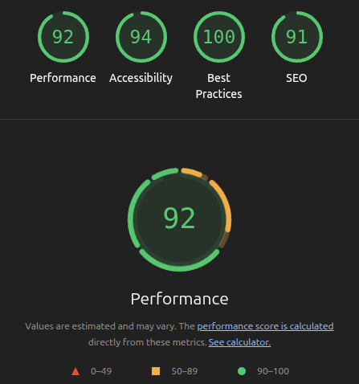
  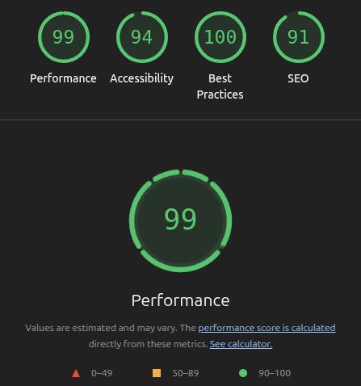
</p>

*In allen Qualitätskategorien (Performance, Accessibility, Best Practices, SEO) werden auf Mobile und Desktop Scores von über 90 erreicht.*

---

## Risiken & technische Schulden

| Bereich | Problem / Risiko | Status & Massnahme |
|---|---|---|
| **Offline-Nutzung am Berg** | Im alpinen Funkloch schlägt das Neuladen fehl; Notfallkontakte wären offline nicht erreichbar. | Konzipiert als nächster Schritt: PWA mit Service Worker und IndexedDB-Cache für Notfallnummern. |
| **GPX-Parsing im Browser** | Riesige GPX-Dateien (> 20 MB) könnten den UI-Thread kurz blockieren. | Aktuell für normale GPX-Tracks ausreichend; künftig Auslagerung in einen Web Worker. |
| **Token-Blacklist** | JWTs sind zustandslos; Logout löscht Token nur im Client. | 1h Ablaufdatum reicht für WebLab; künftig Background-Jobs (z. B. via Hangfire) für Blacklist-Bereinigung. |
| **E2E-Testisolation** | Cypress-Tests teilen sich teilweise Datenbankzustände. | Tests bereinigen ihre Daten eigenständig; für Einzelentwickler im Modul WebLab vollkommen ausreichend. |
